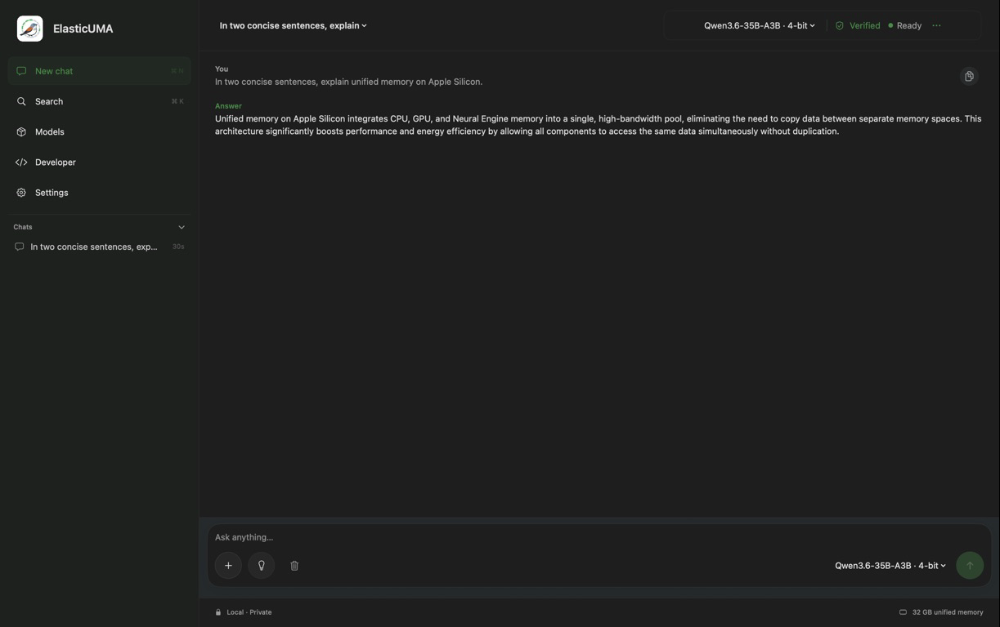
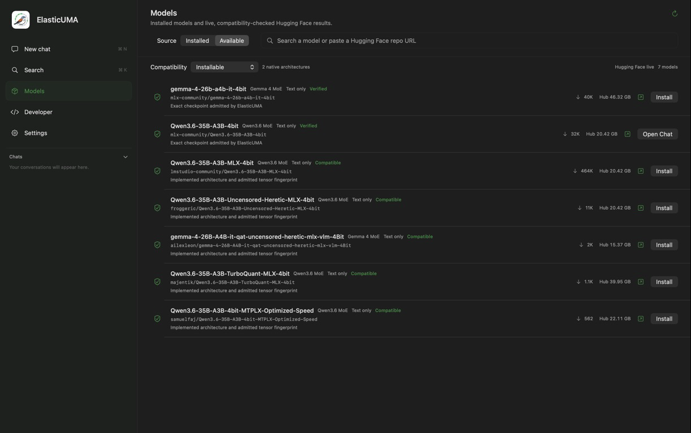
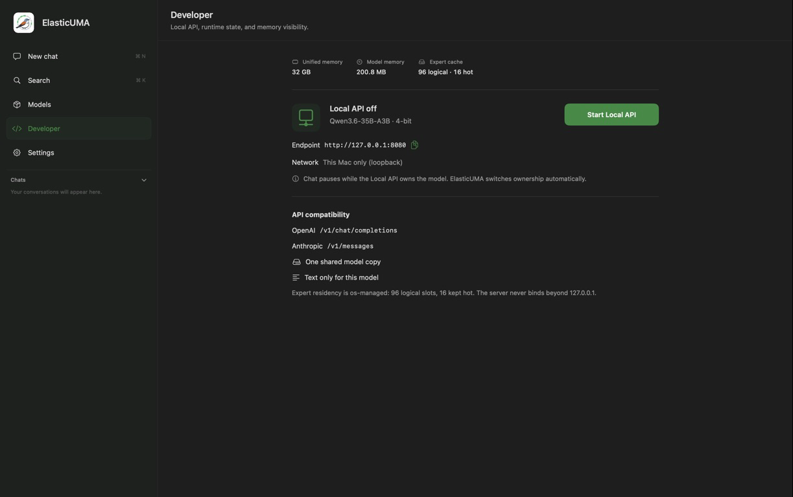

# Mac app

ElasticUMA includes a native SwiftUI app for people who do not want to manage
the runtime from a terminal.

```bash
euma app open
```

The first run builds the pinned native runtime and packages a local
`ElasticUMA.app`. It does not download a model until you choose one and approve
the storage plan.



The screenshot above is the release app generating with the installed
Qwen3.6-35B-A3B model, not a preview responder.

## What the app does

- **Chat** — load one verified local model and stream a private response. The
  composer starts as one line, grows to six lines, then scrolls; it clears
  after Send and changes to Stop while the model is working.
- **Search** — find recent local conversations.
- **Models** — switch between installed models and a live Hugging Face search.
  ElasticUMA enables Install only after the exact architecture, quantization,
  and tensor-index layout pass the native compatibility gate.
- **Developer** — start or stop one loopback API with both OpenAI
  (`/v1/chat/completions`) and Anthropic (`/v1/messages`) routes. The
  app unloads its chat session first so two model workers never compete for the
  same memory, and shows live unified/model memory plus the logical/hot cache.
- **Settings** — change context, cache size, hot slots, generation sampling,
  and the OS-managed/fixed residency policy.

The model catalog shows each profile's end-to-end input modalities. Attachment
controls are enabled per selected model, not globally. The current Qwen and
Gemma profiles are text-only in ElasticUMA because their vision towers are not
part of the packed runtime model.

## Live model library



The **Installed** tab scans the canonical local cache. The **Available** tab
queries Hugging Face live and filters results through ElasticUMA's native
architecture, quantization, and tensor-layout contract. A result marked
**Compatible** or **Verified** can be installed; an unknown layout remains
disabled instead of being presented as supported.

Qwen thinking is optional. When enabled in Settings, reasoning streams into a
lighter collapsible Thinking panel and remains separate from the final answer;
multiple interleaved thinking blocks retain their order. It is off by default
because it increases latency and token use.

The app, CLI, and Python SDK share the same runtime and canonical model paths
under `~/Library/Caches/elasticuma/`. Building or opening another interface does
not create another model copy.

## One local API, two client formats



**Start Local API** hands the already selected model to one loopback server.
Both `POST /v1/chat/completions` and `POST /v1/messages` use that same process
and model copy. The app pauses its chat worker while the server owns the model
and restores normal chat ownership after the API stops. See the
[quick start](quickstart.md#4-start-the-local-api) for tested request examples.

Build without opening:

```bash
euma app build
```

The app is ad-hoc signed for local use. A public binary release would still
need Developer ID signing and Apple notarization.
