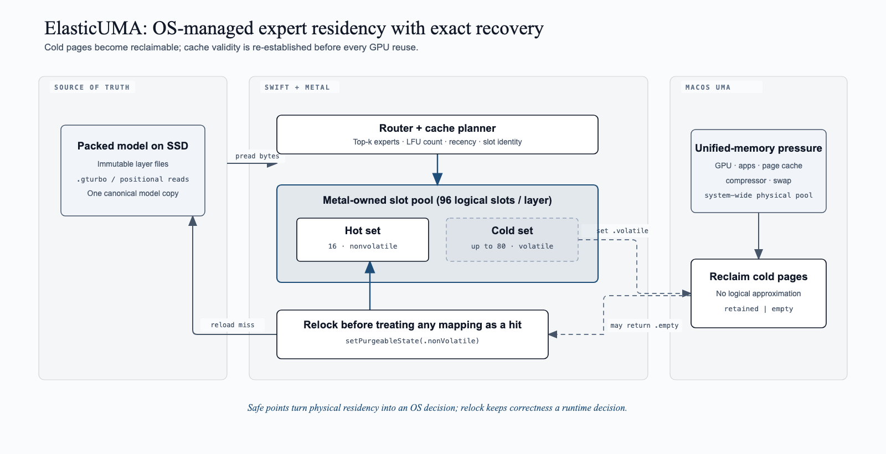
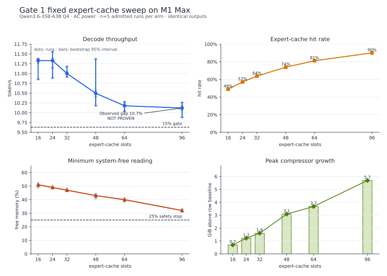
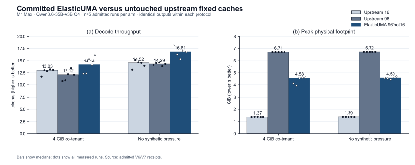
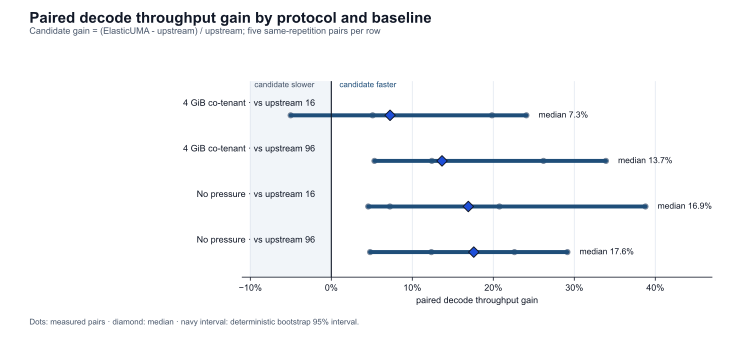
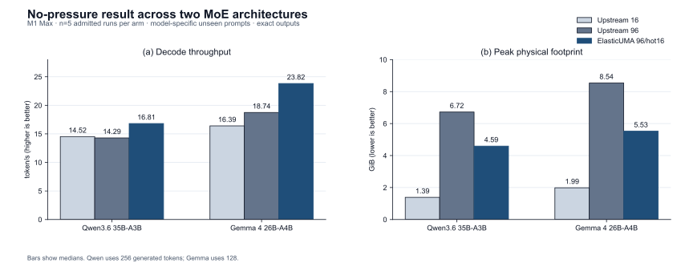

# ElasticUMA: Reload-Correct OS-Managed Expert Caching for Apple Silicon

Naresh Prajapati
Independent Researcher

> Manuscript state: admitted two-architecture, single-machine systems result
> plus a negative precursor gate. Cross-chip, energy, and independent
> reproduction remain open.

## Abstract

Apple Silicon exposes one physical memory pool to the CPU, GPU, operating
system, filesystem cache, and inference runtime. A large routed-expert cache can
therefore raise hit rate while increasing compression and reducing throughput.
We first confirm that effect but reject a preregistered cache-size-controller
gate: 16→96 slots raises Qwen3.6-35B-A3B Q4 hit rate from 48.98% to 90.13%, yet
the paired slowdown is only 10.54%, below the frozen 15% threshold. That
negative result motivates a different mechanism. ElasticUMA stores each expert
in a Metal-owned purgeable slot, keeps the hot working set nonvolatile, and
offers cold slots to macOS at synchronized layer/token boundaries. A volatile
hit is never trusted: the runtime relocks it, converts Metal's `.empty` result
to a miss, and reloads exact bytes before GPU binding. On an M1 Max/32 GB host,
two fresh five-pair protocols compare the committed implementation with
untouched upstream fixed-16 and fixed-96 policies. With a bounded 4 GiB
co-tenant, ElasticUMA gains 7.25% and 13.67% paired-median throughput,
respectively, while reducing fixed-96 peak physical footprint 31.64% and peak
compressor growth 5.05 GiB. Without synthetic pressure, gains are 16.91% and
17.59%, footprint falls 31.65%, and all ten candidate comparisons favor
ElasticUMA. All 30 measured rows are admitted, executor hashes are recorded,
and outputs are byte-identical within each protocol. A third held-out protocol
on Gemma 4 26B-A4B admits 15/15 rows: paired median gains are 45.30% over
fixed-16 and 26.01% over fixed-96, while fixed-96 footprint falls 35.26%.
The result establishes a strong two-architecture Apple-UMA mechanism on one
host; cross-chip, energy, and independent-reproduction claims remain open.

## 1. Introduction

Mixture-of-experts language models separate total capacity from active compute:
each token selects only a small routed subset. FreeToken exploits that property
on discrete-GPU PCs by retaining experts in host memory, caching a subset in
VRAM, and splitting cache misses between CPU compute and PCIe transfer. On an
Apple SoC there is no analogous host/device pool boundary. CPU and GPU share the
same physical memory, while file-backed expert pages, explicit slots, KV or
recurrent state, Metal resources, the display stack, applications, compression,
and swap compete within that pool.

This changes the question from “how much of the expert table fits in device
memory?” to “which allocation maximizes useful service while preserving an OS
headroom invariant?” A cache policy that optimizes its own hit rate may starve
the page cache or inference state, increase compression, and slow down. Conversely,
an overly conservative cache can force avoidable SSD reads.

ElasticUMA uses a falsification-first workflow and contributes:

1. a reproducible characterization of expert residency and macOS unified-memory
   pressure across inference phases;
2. a measured fixed-cache curve showing that cache hit rate is not a valid speed
   objective on the tested Apple unified-memory system;
3. a negative result against a preregistered 15% controller-authorization gate;
4. a reload-correct integration of macOS/Metal purgeability with an explicit
   expert cache at prefill-layer and decode-token safe points;
5. fresh held-out evidence that one 96-slot logical policy beats both upstream
   16- and 96-slot fixed policies while reducing pressure damage; and
6. an evidence-admission pipeline that binds systems claims to complete,
   deterministic, privacy-safe receipts.

## 2. Background and related work

FreeToken, HeteGen, Fiddler, and MoE-Infinity establish heterogeneous expert
execution. MawForge and multiple open Mac engines establish bounded expert
materialization from storage. MLX-LM PR #1588 demonstrates a direct framework
implementation. SwiftLM, slipstream, TurboFieldfare, blackmlx, and
mlx-moe-offload explore explicit slots, persistent buffers, and kernel page
caching. BaseRT demonstrates a native Metal execution boundary; FusionML and
NPUMoE occupy CPU/GPU and NPU co-execution; SliceMoE and ZipMoE occupy sliced and
compressed expert representations; MemSpec and EcoSpec adapt speculative
decoding to memory. A recent kernel-cache study also warns that some pressure
knees can be artifacts of the imposed reclaim mechanism.

ElasticUMA does not claim any of those mechanisms. Its proposed unit of control
is the complete shared UMA service budget and its evaluation target is regret
relative to a per-workload oracle under safe transitions. The full source-by-
source boundary is maintained in `docs/PRIOR_ART.md`.

## 3. Motivation and falsification gate

Let a fixed runtime action be

\[
a=(C_e,C_s,b_s,P,D,R_v,R_d,H),
\]

where \(C_e\) is explicit expert capacity, \(C_s\) and \(b_s\) are inference
state capacity and precision, \(P\) is prefill policy, \(D\) is decoding or
speculation policy, \(R_v\) and \(R_d\) are optional vision/draft residency, and
\(H\) is reserved system headroom. Observed state includes pressure level,
compressor and swap growth, route hits/misses, process footprint, context,
phase, and thermal/power context.

Before implementing the controller, Gate 1 asks whether a larger \(C_e\) can
increase hit rate while reducing decode throughput by at least 15%, with an
independent pressure signal. The fixed sweep, admission rules, and pass threshold
were frozen before the first model measurement. A failed gate is a valid negative
result and stops the headline controller claim.

## 4. System design

### 4.1 One shared UMA budget

The rejected controller proposal would reserve OS/application headroom first,
then divide the remaining
budget among immutable resident weights, expert slots, state, speculative
verification, optional model components, and scratch. It reasons in bytes rather
than expert counts. The budget is constrained by both process needs and live
system pressure because file-backed and application-owned caches can interact.

### 4.2 Metal-owned purgeable slots

The upstream cache wraps externally allocated anonymous memory in
`bytesNoCopy` Metal buffers. Those resources do not surrender the external
allocation when marked empty. ElasticUMA instead allocates each slot through
`MTLDevice.makeBuffer(storageModeShared)`, retaining the stable buffer object
and CPU pointer needed by the existing `pread` path.

After a layer's prefill GPU work completes, and after a complete decode step,
the cache ranks occupied slots by LFU count then recency. The hottest configured
subset remains nonvolatile; every cold nonvolatile slot transitions to
`.volatile`. This lets macOS classify the pages as reclaimable before later
layers materialize, avoiding the full-cache prefill peak observed in an earlier
failed schedule.

### 4.3 Reload correctness

Logical cache membership and physical contents diverge after a slot becomes
volatile. Before planning a hit, ElasticUMA calls
`setPurgeableState(.nonVolatile)` under the cache lock. A retained return
preserves the hit. `.empty` clears the expert identity and recency state; the
access becomes a normal miss and exact bytes are re-read from the immutable
packed layer file before the resource can be bound. State transitions occur
only after GPU completion, and the fixed mode executes none of this path.

### 4.4 Phase-specific policy

Prefill activates a broad expert union and favors sequential layer streaming and
large chunks. Decode exposes temporal route locality and favors bounded expert
slots. Idle or tool boundaries permit state persistence, cache shrinkage, and
safe reconfiguration. Policies therefore change only at phase/synchronization
boundaries; no live Metal graph is mutated in place.

### 4.5 Non-destructive choice

Loading a second cache configuration while the system is pressured changes the
state being observed. The artifact instead records routed-expert traces, cache
events, and resource costs, then estimates counterfactual fixed policies without
materializing them. A conservative policy is selected when estimates are
uncertain. Online probes have explicit byte/time limits.

### 4.6 Safety state machine

The proposed controller states were `SAFE`, `WATCH`, `SHRINK_PENDING`, `RECOVERING`, and
`FALLBACK`. Transitions use hysteresis and dwell time. Warning pressure or rapid
compression queues a shrink at the next safe point; swap acceleration triggers
fallback. Recovery requires sustained normal pressure. The executor never
changes macOS memory policy and never assumes swap already in use was caused by
the current run.

*Figure 1. Metal-owned hot and cold expert slots preserve stable resources and
CPU pointers. Every potential hit is relocked; an empty return invalidates the
mapping and forces an exact positional reload before GPU use.*

## 5. Implementation

The artifact includes a typed Python experiment plane, privacy-safe macOS
telemetry, one-worker and one-download locks, immutable model manifests, a
resumable direct streaming repack, deterministic runtime adapters, balanced
scheduling, raw receipts, and strict admission. The implementation is a
629-line change commit over the pinned native Swift/Metal runtime, including
CLI/server controls and tests. Process memory uses
`proc_pid_rusage().ri_phys_footprint`; RSS is secondary because it includes
reclaimable pages. Runtime receipts expose volatile transitions, relocks,
retained relocks, empty recoveries, invalidations, and cumulative reload bytes.

## 6. Experimental method

The primary host is an M1 Max/32 GB. Gate 1 sweeps Qwen3.6-35B-A3B Q4 at six
expert capacities with one warmup and five alternating-order repetitions. All
arms share model bytes, prompt, context, generation length, decoding parameters,
and runtime. Measurements include throughput, cache events, free percentage,
compressor/swap peaks, pressure level, and process-tree RSS. Every measured row
must pass deterministic output parity and safety checks. Full details and units
are preregistered in `docs/METHODOLOGY.md`.

Successor protocols use unseen prompts and the same 256-token greedy workload.
V6 compares upstream fixed-16, upstream fixed-96, and committed ElasticUMA
96/hot16 with a 4 GiB safety-bounded co-tenant. V7 repeats the three arms with
no pressure worker. Each has one excluded warmup and five balanced measured
triples. Frozen gates require complete admission and exact output; competitive
paired throughput; a material footprint or compressor benefit relative to
fixed-96; no worse swap/critical pressure; and observed exact empty recovery.

## 7. Results

All 30 measured rows were admitted; no measured row timed out or crossed a
safety bound. All responses had one identical SHA-256, every power snapshot was
AC, and the native monitor recorded no warning or critical transition.

| Slots | Cache MiB | Decode tok/s | Hit rate | Min free % | Peak compressor growth MiB |
|---:|---:|---:|---:|---:|---:|
| 16 | 1,136 | 11.330 | 48.98% | 51 | 714.8 |
| 24 | 1,704 | 11.329 | 57.15% | 49 | 1,245.6 |
| 32 | 2,272 | 11.001 | 63.73% | 47 | 1,643.9 |
| 48 | 3,408 | 10.495 | 73.87% | 43 | 3,158.4 |
| 64 | 4,544 | 10.177 | 81.17% | 40 | 3,766.3 |
| 96 | 6,816 | 10.120 | 90.13% | 32 | 5,830.0 |

The figure shows individual throughput/free-memory observations and medians;
throughput error bars are deterministic bootstrap intervals. The dashed 15%
line is the frozen Gate threshold relative to the 16-slot median, while the 25%
line is the measured-row safety stop. The chart should be read as descriptive
evidence on one host/workload, not a causal or cross-machine estimate.

The strongest comparison was 16 versus 96 slots. Its aggregate median slowdown
was 10.68%; the paired gaps were 10.72%, 10.84%, 10.54%, 9.45%, and 8.94%.
The paired median was 10.54%, with a deterministic percentile-bootstrap 95%
interval of 8.94–10.84% and 5/5 directional support. Hit rate improved 41.15
percentage points while the minimum-free statistic fell 19 points and median
peak compressor growth increased by roughly 5.0 GiB.

The pressure-backed tradeoff is real, stable, and smaller than the 15% threshold.
Gate 1 is therefore **NOT PROVEN**. The admitted artifact SHA-256 is
`094d9f73549c332046fbfeb5459d2338c12ae5eb9494f473319a6a97b5910ab8`.

### 7.1 Committed mechanism against upstream baselines

The pressure-backed V6 experiment admits all 15 measured rows. ElasticUMA's
candidate executor is commit `ec84269d5ce162a0376099d39b30dd19aa99f096`;
candidate and upstream binary hashes are embedded in every row.

| 4 GiB co-tenant | Decode tok/s | Hit rate | Peak footprint GiB | Peak compressor GiB | Min free % |
|---|---:|---:|---:|---:|---:|
| Upstream fixed 16 | 13.025 | 47.91% | 1.374 | 0.675 | 57 |
| Upstream fixed 96 | 12.116 | 90.81% | 6.705 | 5.890 | 38 |
| ElasticUMA 96 / hot 16 | 14.136 | 86.83% | 4.584 | 0.840 | 44 |

Relative to upstream-96, the paired median gain is 13.67% (deterministic
bootstrap 95% interval 5.33–33.91%), peak footprint is 31.64% lower, and peak
compressor growth is 5.05 GiB lower. Relative to upstream-16, the paired median
gain is 7.25%; the interval spans 5.02% slower to 24.08% faster, while effective
hit rate improves by 38.92 points. No arm grows swap. The admitted artifact
SHA-256 is
`5b23799f865385ceaf09aef5b4200d7c1da45e97170e01486e7bcaa641bfa0ad`.

V7 admits another 15 measured rows without a pressure worker:

| No co-tenant | Decode tok/s | Hit rate | Peak footprint GiB | Peak compressor GiB | Min free % |
|---|---:|---:|---:|---:|---:|
| Upstream fixed 16 | 14.520 | 49.82% | 1.386 | 0 | 57 |
| Upstream fixed 96 | 14.293 | 90.58% | 6.721 | 5.991 | 38 |
| ElasticUMA 96 / hot 16 | 16.807 | 87.50% | 4.594 | 0.700 | 44 |

ElasticUMA wins all five pairs against both baselines. Paired median gains are
16.91% over upstream-16 (95% interval 4.56–38.79%) and 17.59% over upstream-96
(4.79–29.15%). Fixed-96 footprint falls 31.65% and compressor growth falls
5.29 GiB. The admitted artifact SHA-256 is
`06b78c1f2473256c7067dc05bf63c974d863bec22edf2cda9dc0b36e4527fa8e`.

### 7.2 Second architecture: Gemma 4 26B-A4B

V8 repeats the no-pressure three-arm protocol with a one-copy verified Gemma 4
26B-A4B Q4 artifact, a new prompt, and 128 generated tokens. All 15 measured
rows are admitted with one output hash.

| Gemma 4 | Decode tok/s | Hit rate | Peak footprint GiB | Peak compressor GiB | Min free % |
|---|---:|---:|---:|---:|---:|
| Upstream fixed 16 | 16.394 | 65.52% | 1.986 | 0 | 69 |
| Upstream fixed 96 | 18.742 | 98.40% | 8.538 | 5.114 | 50 |
| ElasticUMA 96 / hot 16 | 23.820 | 95.79% | 5.527 | 1.073 | 55 |

ElasticUMA wins every pair. Paired median gains are 45.30% over fixed-16
(bootstrap 95% interval 23.45–51.44%) and 26.01% over fixed-96
(11.88–28.55%). Fixed-96 footprint falls 35.26% and compressor growth falls
4.04 GiB. The artifact SHA-256 is
`2b1c312e5660539c350082ca70ef65e8a93c6ee958ef947e8478598a4cba0a9e`.

## 8. Gate outcome and research pivot

An expert-cache-size controller was not justified: the largest safe arm lost
only about 10.5%, not the preregistered 15%. We did not lower that threshold.
Instead, microgates rejected `F_NOCACHE`, direct mmap, raw/compressed MTLIO, and
coarse per-layer purgeability before selective per-slot residency passed.

The successful design changes memory ownership and validity semantics rather
than selecting a smaller fixed cache. That distinction matters: under both
successor protocols, one logical 96-slot configuration retains most large-cache
locality, avoids its pressure collapse, and beats the strongest 16-slot fixed
fallback. The result passes its frozen one-host/model gates and authorizes
generalization work; it does not erase the negative Gate-1 result.

## 9. Limitations and ethics

One machine, even with two model architectures, cannot support a general Apple
claim. macOS public telemetry is coarse and causal attribution requires
controlled experiments. The current
runtime does not expose generated token IDs, GPU power, per-read storage bytes,
or complete thermal signals. Model quality and license terms are independent of
systems speed. Public artifacts must remove personal paths and never include
private prompts, serials, UUIDs, credentials, or copyrighted model weights.
Human authors must verify all results and disclose AI assistance under venue
policy.

The current positive evaluation has one host, two MoE architectures, short
held-out prompts, one context limit, and batch size one. Model-specific prompts
and generation lengths prevent interpreting cross-model token/s as a model
benchmark. The 4 GiB co-tenant is synthetic. Energy is unmeasured. macOS
compressor association is diagnostic, although the mechanism's `.empty`
receipts directly establish reclamation/reload. The Qwen3.8 dense control
crossed its frozen free-memory guard before a complete dataset, so its partial
speed numbers are not a baseline result.

## 10. Conclusion

ElasticUMA begins with a negative result: maximizing explicit expert capacity
nearly doubles hit rate while slowing inference and consuming unified-memory
headroom, but the gap misses a preregistered controller threshold. A different
mechanism—reload-correct, selective Metal purgeability at true GPU-safe
boundaries—turns that pressure into a Pareto improvement on the measured M1 Max
workloads. It retains most 96-slot locality, cuts footprint by about one third,
and beats both upstream 16- and 96-slot fixed policies with and without a
synthetic co-tenant. This is a paper-worthy scoped result, not yet a universal
Apple claim. The remaining bar is breadth: other Apple generations, real desktop
traces, energy, and independent reproduction.
